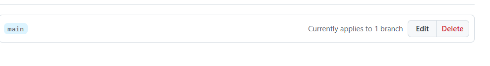
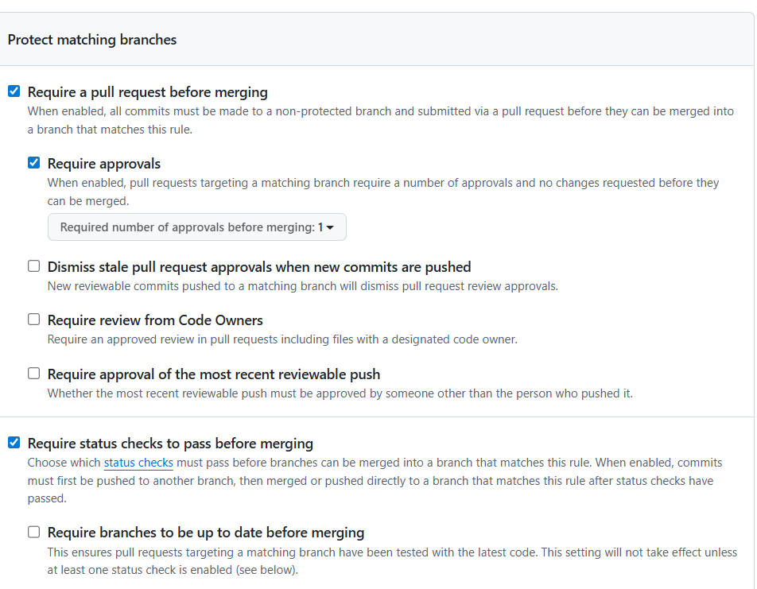
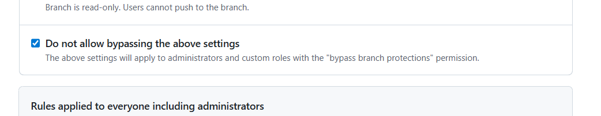
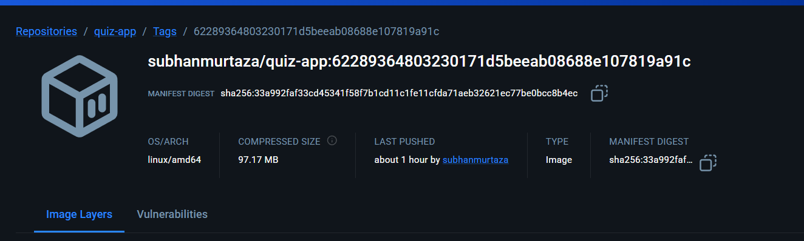
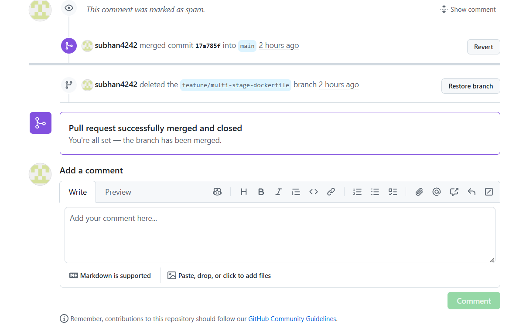
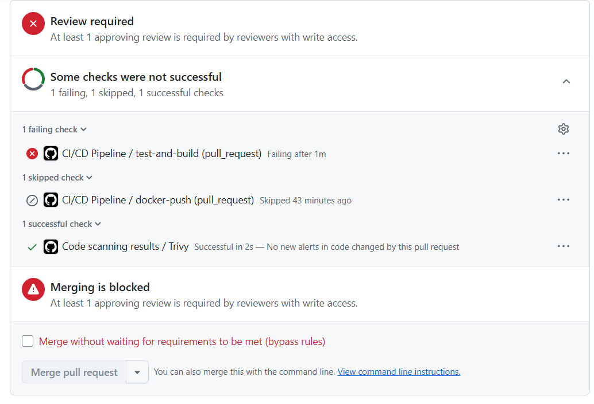
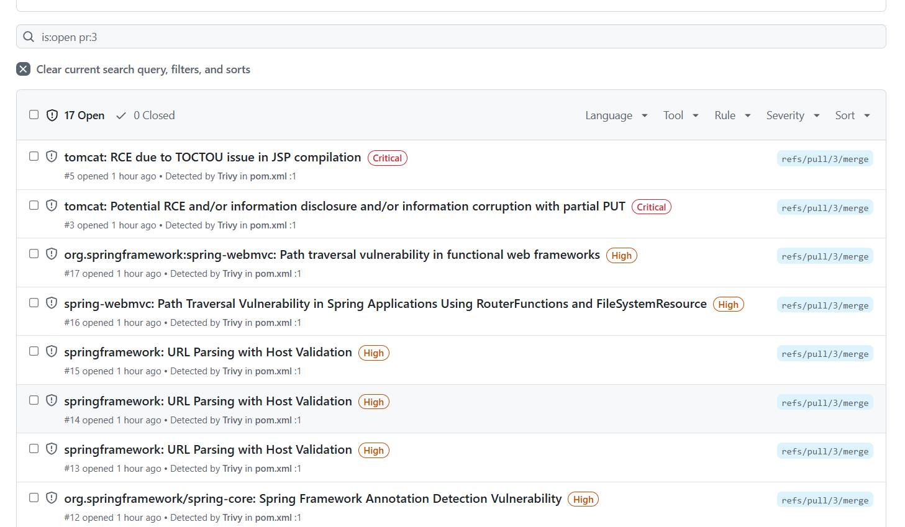
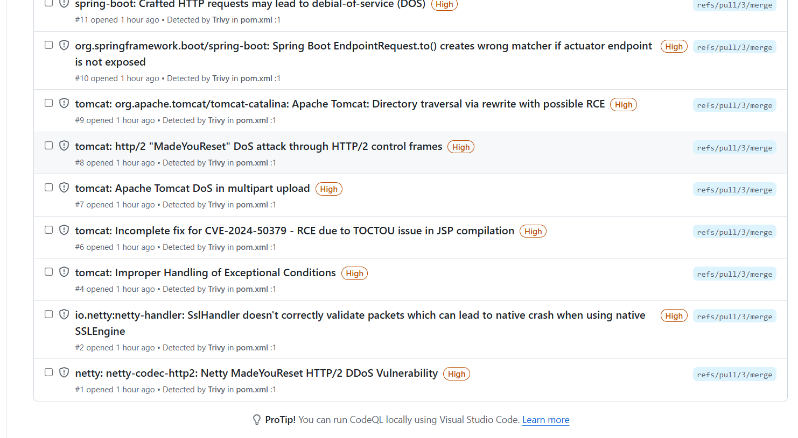

# SVAR.md

## Oppgave 1: DevOps-prosess for team

### Branch-strategi

Teamet bruker **GitHub Flow** som branch-strategi. Main-branchen er alltid produksjonsklar og ingen pusher direkte til den. For hver ny feature, bugfix eller oppgave opprettes en egen branch fra main. Branches navngis etter mønsteret `feature/kort-beskrivelse`, `bugfix/kort-beskrivelse` eller `hotfix/kort-beskrivelse`, for eksempel `feature/add-quiz-endpoint` eller `bugfix/fix-null-response`. Dette gjør det enkelt å forstå hva en branch inneholder uten å åpne koden.

### Pull Request-prosess

Når en utvikler er ferdig med arbeidet på sin branch, opprettes en Pull Request (PR) mot main. PR skal alltid opprettes selv om endringen er liten, fordi det gir teamet mulighet til å gjennomgå koden før den merges. Minimum én annen utvikler må godkjenne PR-en før den kan merges. Revieweren sjekker at koden er lesbar, at tester er inkludert og at endringen løser det den skal. Utvikleren som laget PR-en er ansvarlig for å rydde opp i kommentarer og feil før merge.

### Branch Protection

Main-branchen beskyttes med følgende regler i GitHub:
- **Require a pull request before merging** – ingen kan pushe direkte til main
- **Require approvals (minimum 1)** – minst én annen utvikler må godkjenne
- **Require status checks to pass** – alle automatiske tester må være grønne før merge
- **Do not allow bypassing the above settings** – gjelder også admins

Disse reglene er kritiske når teamet vokser. Uten dem er det lett at én utvikler ved et uhell pusher kode som brekker produksjon, eller at kode som ikke er gjennomgått havner i main.

### Automatisering

Følgende automatiske sjekker kjøres via GitHub Actions:

- **På Pull Request:** Kjør unit tester (`mvn test`), bygg applikasjonen (`mvn package`), bygg Docker image, skann for sikkerhetssårbarheter med Trivy. Pipeline feiler hvis CRITICAL eller HIGH sårbarheter oppdages. Dette sikrer at ingen usikker eller ødelagt kode merges inn.
- **På push til main:** Kjør tester, bygg og push Docker image til Docker Hub med commit SHA og `latest` tag. Dette gir en automatisk og sporbar deployment-prosess.

Automatiseringen gjør at teamet ikke er avhengig av manuelle sjekker, og alle endringer går gjennom samme kvalitetsport uavhengig av hvem som har skrevet koden.

### Skjermbilder og konfigurasjon

## Oppgave 2: Docker multi-stage build

### Endringer i Dockerfile

Den originale Dockerfile brukte single-stage build med Maven-imaget som base,
noe som resulterte i et image på ~700MB siden alle build-verktøy ble med i det finale imaget.
I tillegg manglet den CMD/ENTRYPOINT, så applikasjonen startet ikke ved `docker run`.

Den nye Dockerfile bruker multi-stage build:
- **Stage 1 (build):** Maven image bygger JAR-filen
- **Stage 2 (runtime):** eclipse-temurin:21-jre-alpine kopierer kun JAR-filen

### Sammenligning av image-størrelse

| | Før | Etter |
|---|---|---|
| Base image | maven:3.9.5-eclipse-temurin-21 | eclipse-temurin:21-jre-alpine |
| Image størrelse | ~700MB | 97.2 MB |
| Build-verktøy inkludert | Ja | Nei |
| CMD/ENTRYPOINT | Mangler | Ja |

### Skjermbilder

---

## Oppgave 3: GitHub Actions pipeline

### Pipeline-beskrivelse

CI/CD-pipelinen er implementert i `.github/workflows/ci.yml` med to jobs:

**På Pull Request (test-and-build):**
- Kjører unit tester med `mvn test`
- Bygger applikasjonen med `mvn package`
- Bygger Docker image
- Scanner filesystem for sårbarheter med Trivy (CRITICAL/HIGH)
- Scanner Docker image med Trivy (CRITICAL/HIGH)
- Pipeline feiler hvis CRITICAL eller HIGH sårbarheter oppdages
- SARIF-rapport lastes opp til GitHub Security-fanen

**På push til main (docker-push):**
- Kjører tester og bygger applikasjonen
- Logger inn på Docker Hub
- Pusher Docker image med `latest` og commit SHA tag

### Lenker

- Vellykket workflow-kjøring på main (med Docker push):(https://github.com/subhan4242/devops-konte-2026-15/actions/runs/22211247372)
- Pull Request med Trivy-scanning:(https://github.com/subhan4242/devops-konte-2026-15/pull/3)

### Skjermbilder

## Oppgave 4: Teori - DevOps i en AI-akselerert verden

### Hvorfor blir DevOps viktigere når AI gjør oss mer produktive?

AI-verktøy som GitHub Copilot, ChatGPT og Claude har fundamentalt endret hvordan 
programvare utvikles. Det som tidligere tok dager kan nå gjøres på timer. En utvikler 
kan be en AI om å generere en hel Spring Boot-applikasjon med REST-endepunkter, 
modeller og tjenester, og få fungerende kode tilbake på minutter. Dette prosjektet er 
selv et godt eksempel quiz-applikasjonen ble opprinnelig utviklet ved hjelp av 
AI-verktøy.

Men høy utviklingshastighet uten solide prosesser rundt skaper nye og større risikoer. 
AI-verktøy er svært gode til å generere kode som ser riktig ut, men de introduserer 
også feil og sikkerhetsproblemer i samme tempo. I dette prosjektet avdekket Trivy 17 
sårbarheter i dependencies inkludert kritiske RCE-sårbarheter i Tomcat og Spring Boot. 
Dette er akkurat den typen problemer som er enkle å overse når man fokuserer på å få 
koden til å fungere raskt.

Dette illustrerer et viktig poeng: når utviklingshastigheten øker, øker også behovet 
for automatiserte kvalitetsporter. Uten CI/CD-pipeline og automatisk sikkerhetsskanning 
ville disse sårbarhetene potensielt havnet i produksjon uten at noen oppdaget dem. 
Med GitHub Actions og Trivy stopper pipelinen automatisk og varsler teamet før koden 
kan merges til main.

Branch-strategi og pull request-prosess blir også viktigere når teamet vokser og 
bruker AI. Når alle kan generere kode raskt, er det lett å havne i en situasjon hvor 
mange endringer skjer parallelt og ingen har full oversikt. En strukturert branch-strategi 
med feature-branches og obligatorisk code review sikrer at endringer blir gjennomgått 
av minst ett annet par øyne før de når produksjon. Dette fanger opp ikke bare tekniske 
feil, men også arkitekturproblemer og AI-genererte antipatterns som hardkodede 
credentials noe vi selv opplevde i dette prosjektet da AWS-nøkler nesten havnet i 
et public repository.

Docker og containerisering blir en viktig stabiliserende faktor i et AI-akselerert team. 
Når kode genereres raskt av ulike utviklere med ulike miljøer, sikrer en god Dockerfile 
at applikasjonen oppfører seg likt overalt. Multi-stage builds reduserer image-størrelsen 
fra ~700MB til 97MB, noe som direkte påvirker deploy-hastighet og kostnad i produksjon.

Paradoksalt nok er konklusjonen at jo raskere AI gjør oss som utviklere, jo viktigere 
blir de "langsomme" prosessene rundt code review, automatisk testing, 
sikkerhetsskanning og strukturert branching. AI senker terskelen for å skrive kode, 
men hever ikke automatisk kvaliteten på prosessene rundt. DevOps fyller dette gapet 
ved å bygge kvalitet og sikkerhet inn i selve utviklingsprosessen, slik at teamet kan 
opprettholde høy fart uten å gå på bekostning av stabilitet og sikkerhet i produksjon.
